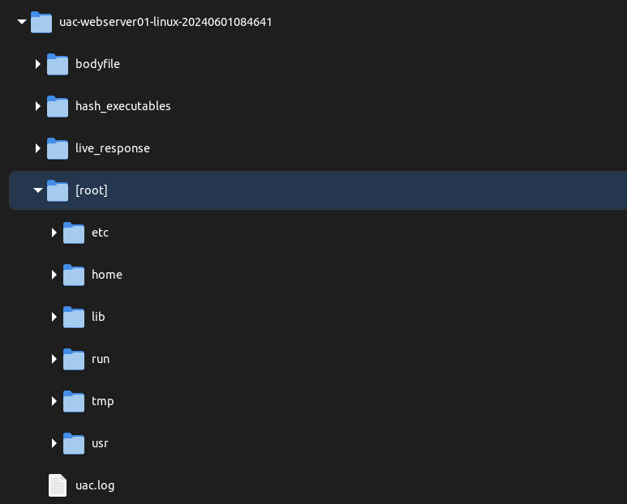
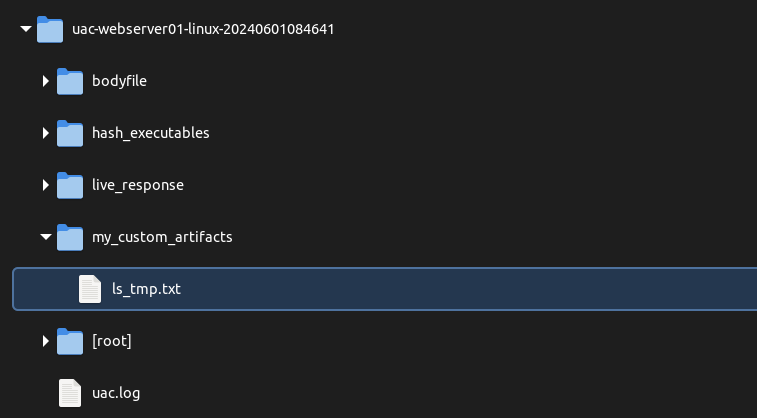

<!-- markdownlint-disable MD036 -->
# Artifacts definition

Artifacts define parameters for a collector to gather data.

UAC reads the YAML files dynamically and, based on their contents, uses one of the five available collectors ([command](#command), [file](#find-based-collectors), [find](#find-based-collectors), [hash](#find-based-collectors) and [stat](#find-based-collectors)) to collect the relevant artifacts.

The example below contains two sets of rules: the first set uses the [hash](#collector) collector, and the second set uses the [command](#collector) collector to gather the artifacts.

```yaml
version: 1.0
artifacts:
  -
    description: Hash running processes.
    supported_os: [aix]
    collector: hash
    path: /proc/[0-9]*/object/a.out
    output_directory: /live_response/process
    output_file: hash_running_processes
  -
    description: Report a snapshot of the current processes.
    supported_os: [aix, freebsd, linux, macos, netbsd, openbsd, solaris]
    collector: command
    command: ps auxwww
    output_directory: /live_response/process
    output_file: ps_auxwww.txt
```

It is common practice to group all artifacts related to the same topic within a single YAML file. This approach allows for more granular artifact collection based on the specific case you are working on.

An artifact has one required field at the top of the file [version](#version), followed by a set of rules that will be used by one of the [collectors](#collector) to collect the desired data.

The [version](#version) should be incremented as artifacts are updated or additional artifacts are added.

## artifacts

**Required**

Set of rules (sequence of mappings) that define what data will be collected.

An artifact rule must include three mandatory fields: [description](#description), [supported_os](#supported_os), and [collector](#collector), along with additional properties depending on the chosen collector.

```yaml
version: 1.0
artifacts:
  -
    description: Report a snapshot of the current processes.
    supported_os: [all]
    collector: command
    ... # additional options depending on the collector
  -
    description: Hash files that contain at least +x flag set for owner.
    supported_os: [all]
    collector: hash
    ... # additional options depending on the collector
  -
    description: Collect /var/log logs.
    supported_os: [all]
    collector: file
    ... # additional options depending on the collector
```

## collector

**Required**

UAC uses collectors to gather data, with each collector serving a specific function and requiring its options.

### command

Use this collector to run commands and store the output into an output file. In a nutshell, UAC will use ```eval``` to run the command and redirect the stdout to the output file. The stderr will be captured and added to [uac.log](log_files.md#uaclog) file as a log record.

Required fields:

- [command](#command)
- [output_directory](#output_directory)

Optional fields:

- [compress_output_file](#compress_output_file)
- [condition](#condition)
- [exclude_nologin_users](#exclude_nologin_users)
- [foreach](#foreach)
- [output_file](#output_file)
- [redirect_stderr_to_stdout](#redirect_stderr_to_stdout)

### find based collectors

These collectors use the ```find``` tool to search for files and directories before collecting or processing any data.

As an example, the artifact below...

```yaml
version: 1.0
artifacts:
  -
    description: Collect nginx logs.
    supported_os: [aix, freebsd, linux, macos, netbsd, netscaler, openbsd, solaris]
    collector: file
    path: /var/log
    exclude_path_pattern: ["/sys", "/proc"]
    name_pattern: ["*access_log*", "*access.log*", "*error_log*", "*error.log*"]
    max_depth: 5
    file_type: [f]
    max_file_size: 1073741824 # 1GB
```

...will become this:

```shell
find /var/log -maxdepth 5 \( -path "/sys" -o -path "/proc" \) -prune -o -size -1073741824c  \( -name "*access_log*" -o -name "*access.log*" -o -name "*error_log*" -o -name "*error.log*" \) -print
```

Since the ```find``` tool varies between operating systems, UAC will determine which options are supported by the ```find``` tool on the target system to build the correct find command at runtime. UAC can also use a Perl-based implementation of the find command provided in the tools/find_pl directory.

For example, if the artifact above is executed on a system where the ```find``` tool does not support the ```-maxdepth``` and ```-path``` options, and perl is also not available, the find command will be:

```shell
find /var/log -size -1073741824c  \( -name "*access_log*" -o -name "*access.log*" -o -name "*error_log*" -o -name "*error.log*" \) -print
```

Since the Perl-based implementation of the find command supports most known options, the same example will result in the following command:

```shell
find_pl /var/log -maxdepth 5 \( -path "/sys" -o -path "/proc" \) -prune -o -size -1073741824c  \( -name "*access_log*" -o -name "*access.log*" -o -name "*error_log*" -o -name "*error.log*" \) -print
```

This is done to prevent the ```find``` command from failing during the collection due to an invalid option.

#### find

Use this collector to find files and directories and store the output into a text file.

Required fields:

- [path](#path)
- [output_directory](#output_directory)
- [output_file](#output_file)

Optional fields:

- [condition](#condition)
- [description](#description)
- [exclude\_file\_system](#exclude_file_system)
- [exclude\_name\_pattern](#exclude_name_pattern)
- [exclude\_nologin\_users](#exclude_nologin_users)
- [exclude\_path\_pattern](#exclude_path_pattern)
- [file\_type](#file_type)
- [ignore\_date\_range](#ignore_date_range)
- [max\_depth](#max_depth)
- [max\_file\_size](#max_file_size)
- [min\_file\_size](#min_file_size)
- [name\_pattern](#name_pattern)
- [no\_group](#no_group)
- [no\_user](#no_user)
- [output\_directory](#output_directory)
- [output\_file](#output_file)
- [path](#path)
- [path\_pattern](#path_pattern)
- [permissions](#permissions)

#### hash

Use this collector to hash files and store the output into a text file. The algorithms are defined in the [uac.conf](config_file.md#hash_algorithm) file.

Required fields:

- [path](#path)
- [output_directory](#output_directory)
- [output_file](#output_file)

Optional fields:

- [condition](#condition)
- [description](#description)
- [exclude\_file\_system](#exclude_file_system)
- [exclude\_name\_pattern](#exclude_name_pattern)
- [exclude\_nologin\_users](#exclude_nologin_users)
- [exclude\_path\_pattern](#exclude_path_pattern)
- [file\_type](#file_type)
- [ignore\_date\_range](#ignore_date_range)
- [is\_file\_list](#is_file_list)
- [max\_depth](#max_depth)
- [max\_file\_size](#max_file_size)
- [min\_file\_size](#min_file_size)
- [name\_pattern](#name_pattern)
- [no\_group](#no_group)
- [no\_user](#no_user)
- [output\_directory](#output_directory)
- [output\_file](#output_file)
- [path](#path)
- [path\_pattern](#path_pattern)
- [permissions](#permissions)

#### stat

Use this collector to extract information from files and directories to create a [body file](https://wiki.sleuthkit.org/index.php?title=Body_file).

Some systems do not have the ```stat``` tool available, but do have Perl (e.g., AIX). In this case, UAC will use a Perl-based version (```stat_pl```) to extract information from files and directories.

Required fields:

- [path](#path)
- [output_directory](#output_directory)
- [output_file](#output_file)

Optional fields:

- [condition](#condition)
- [description](#description)
- [exclude\_file\_system](#exclude_file_system)
- [exclude\_name\_pattern](#exclude_name_pattern)
- [exclude\_nologin\_users](#exclude_nologin_users)
- [exclude\_path\_pattern](#exclude_path_pattern)
- [file\_type](#file_type)
- [ignore\_date\_range](#ignore_date_range)
- [is\_file\_list](#is_file_list)
- [max\_depth](#max_depth)
- [max\_file\_size](#max_file_size)
- [min\_file\_size](#min_file_size)
- [name\_pattern](#name_pattern)
- [no\_group](#no_group)
- [no\_user](#no_user)
- [output\_directory](#output_directory)
- [output\_file](#output_file)
- [path](#path)
- [path\_pattern](#path_pattern)
- [permissions](#permissions)

#### file

Use this collector to collect files and directories (in their raw format). Collected files will be stored in the ```[root]``` directory within the output file.



Required fields:

- [path](#path)

Optional fields:

- [condition](#condition)
- [description](#description)
- [exclude\_file\_system](#exclude_file_system)
- [exclude\_name\_pattern](#exclude_name_pattern)
- [exclude\_nologin\_users](#exclude_nologin_users)
- [exclude\_path\_pattern](#exclude_path_pattern)
- [file\_type](#file_type)
- [ignore\_date\_range](#ignore_date_range)
- [is\_file\_list](#is_file_list)
- [max\_depth](#max_depth)
- [max\_file\_size](#max_file_size)
- [min\_file\_size](#min_file_size)
- [name\_pattern](#name_pattern)
- [no\_group](#no_group)
- [no\_user](#no_user)
- [path](#path)
- [path\_pattern](#path_pattern)
- [permissions](#permissions)

<!-- markdownlint-disable MD024 -->
## command
<!-- markdownlint-enable MD024 -->

**Required by: command**

**_Accepted values:_** _one or multiple shell commands_

The command will be executed on the target system, and the output will be collected.

You do not need to specify the path to the executable as it is expected to be in the PATH; only the executable's name and parameters are required.

UAC can also run executables located in the ```bin``` directory. In this case, the path to the executable is still not required, as the ```bin``` directory is automatically added to PATH when UAC runs. For more information, refer to the ```bin/README.md``` file.

The example below demonstrates how to collect the output from the ```ps -ef``` command:

```yaml
version: 1.0
artifacts:
  -
    description: Report a snapshot of the current processes.
    supported_os: [all]
    collector: command
    command: ps -ef
    output_directory: /live_response/process
    output_file: ps_-ef.txt
```

## compress_output_file

**Optional for: command**

**_Accepted values:_** _true or false_

If this option is set to ```true```, the output file will be compressed using ```gzip``` (when gzip is available).

The example below will result in a compressed ```ps_-ef.txt.gz``` file.

```yaml
version: 1.0
output_directory: /live_response/process
artifacts:
  -
    description: Report a snapshot of the current processes.
    supported_os: [all]
    collector: command
    command: ps -ef
    output_file: ps_-ef.txt
    compress_output_file: true
```

Note that ```compress_output_file``` only applies to files specified in the ```output_file``` key-value pair.

## condition

**Optional for: command, file, find, hash and stat**

**_Accepted values:_** _one or multiple shell commands_

The collection will only run if the condition returns true. This feature is very useful for preventing UAC from executing numerous commands if a specific condition does not apply to the target system.

In the example below, the command will only be executed if the condition ```ls /proc/$$``` returns true.

```yaml
version: 1.0
output_directory: /live_response/process
artifacts:
  -
    description: Collect running processes executable path.
    supported_os: [freebsd]
    condition: ls /proc/$$
    collector: command
    command: ls -l /proc/[0-9]*/file
    output_file: running_processes_full_paths.txt
```

You can prefix the command with an exclamation mark (!) to perform an 'if not' condition.

In the example below, the command will only be executed if the condition ```ls /proc/$$``` returns false.

```yaml
version: 1.0
output_directory: /live_response/process
artifacts:
  -
    description: Collect running processes executable path.
    supported_os: [freebsd]
    condition: ! ls /proc/$$
    collector: command
    command: ps -eo args | grep ^/ | awk '{print $1}' | sort -u
    output_file: running_processes_full_paths.txt
```

The condition key-pair value can also be used as a global option, placed before the ```artifacts``` mapping. In this case, the collection will only proceed if the global condition returns true.

In the example below, the data will only be collected if the global condition returns true.

```yaml
version: 1.0
output_directory: /live_response/process
condition: ls /proc/$$
artifacts:
  -
    description: Hash running processes.
    supported_os: [linux, netbsd]
    collector: hash
    path: /proc/[0-9]*/exe
    output_file: hash_running_processes
  -
    description: Hash running processes.
    supported_os: [freebsd]
    collector: hash
    path: /proc/[0-9]*/file
    output_file: hash_running_processes
```

## description

**Required**

Description of what will be collected. No line breaks are supported.

## exclude_file_system

**Optional for: file, find, hash and stat**

**_Accepted values:_** _array of file systems_

Use this option to exclude file systems from the collection. UAC will retrieve the list of existing mountpoints (paths) at runtime and exclude them from the collection.

The file system types that are supported depend on the target computer's running kernel. _Note that exclude_file_system will be ignored when path_pattern is used._

```yaml
version: 1.0
output_directory: /live_response/system
artifacts:
  -
    description: Search all files excluding any files located in procfs, nfs and devfs file systems.
    supported_os: [all]
    collector: find
    path: /
    exclude_file_system: [procfs, nfs, devfs]
    output_file: exclude_procfs_nfs_devfs.txt
```

## exclude_name_pattern

**Optional for: file, find, hash and stat**

**_Accepted values:_** _array of paths_

Use this option to exclude files from the collection. This option works the same way as find's -name -prune option.

Since the leading directories are removed, the file names considered for a match with name_pattern will never include a slash, so ```"a/b"``` will never match anything.

Don't forget to enclose the pattern in double quotes. Use a backslash (\\) to escape double quotes and commas.

As UAC uses ```find``` tool to search for artifacts, wildcards and regex patterns are also supported here.

```yaml
version: 1.0
output_directory: /live_response/system
artifacts:
  -
    description: Search /etc excluding passwd and shadow* files.
    supported_os: [all]
    collector: find
    path: /etc
    exclude_name_pattern: ["passwd", "shadow*"]
    output_file: etc_excluding_passwd_shadow.txt
```

## exclude_nologin_users

**Optional for: command, file, find, hash and stat**

**_Accepted values:_** _true or false_

Use this option to search for artifacts only from users with a valid shell. Any user with no shell will be skipped from the collection.

By default, UAC will always search for artifacts from all users.

```yaml
version: 1.0
artifacts:
  -
    description: Run 'ls -lRa' on all home directories for users that have a valid shell only.
    supported_os: [all]
    collector: command
    command: ls -lRa /%user_home%/
    exclude_nologin_users: true
    output_directory: /live_response/%user%
    output_file: ls_-lRa_%user%.txt
```

## exclude_path_pattern

**Optional for: file, find, hash and stat**

**_Accepted values:_** _array of paths_

Use this option to exclude paths from the collection. This option works the same way as find's -path -prune option.

Don't forget to enclose the pattern in double quotes. Use a backslash (\\) to escape double quotes and commas.

As UAC uses ```find``` tool to search for artifacts, wildcards and regex patterns are also supported here.

```yaml
version: 1.0
output_directory: /live_response/system
artifacts:
  -
    description: Search all excluding /etc and /var.
    supported_os: [all]
    collector: find
    path: /
    exclude_path_pattern: ["/dev", "/var"]
    output_file: all_excluding_etc_var.txt
```

## file_type

**Optional for: file, find, hash and stat**

**_Accepted values:_** _array of file types_

Use this option to specify the type of file to search for, such as directories (d), regular files (f), symbolic links (l), and other file types. This option works the same way as find's -type option.

File is of type:

|Value|Description|
|---|---|
|f|regular file|
|d|directory|
|l|symbolic link|
|p|named pipe (FIFO)|
|s|socket|
|b|block special|
|c|character special|

```yaml
version: 1.0
output_directory: /live_response/system
artifacts:
  -
    description: Search files only.
    supported_os: [all]
    collector: find
    path: /
    file_type: [f]
    output_file: files_only.txt
  -
    description: Search directories only.
    supported_os: [all]
    collector: find
    path: /
    file_type: [f, d, l]
    output_file: directories_only.txt
```

## foreach

**Optional for: command**

**_Accepted values:_** _one or multiple shell commands_

The command will be executed, and its output lines will be used as input by the [command](#command) key-value pair.

The logic behind it is:

```shell
for (each line returned by foreach); do
  command
done
```

The ```%line%``` variable has to be used and will be replaced by each line returned by the execution of the ```foreach``` command at runtime. The ```%line%``` variable can also be used on ```output_directory``` and ```output_file``` key-value pairs.

Let's suppose you need to collect container logs, and you don't know the container IDs. First, you need to retrieve all the IDs: ```docker container ps -all | sed 1d | awk '{print $1}'```

The ```%line%``` variable will be replaced by each output line generated by the command (which are container IDs in the example above).

This implies that if you have 10 containers, the command ```docker container logs %line%``` will be executed 10 times, once for each container ID.

Example:

```yaml
version: 1.0
artifacts:
  -
    description: Fetch the logs of all containers.
    supported_os: [linux]
    collector: command
    foreach: docker container ps -all | sed 1d | awk '{print $1}'
    command: docker container logs %line%
    output_directory: /live_response/containers/%line%
    output_file: docker_container_logs_%line%.txt
```

## ignore_date_range

**Optional for: file, find, hash and stat**

**_Accepted values:_** _true or false_

Use this option to collect files ignoring the date set using both --start-date and --end-date command line options.

This is useful when you want to set a date range for your collection, but want to collect some files regardless of their last accessed, modified and changed dates.

For example, search for all files and subdirectories from /etc regardless of their last accessed, modified and changed dates, even if a date range was set using --start-date and --end-date command line options.

```yaml
version: 1.0
output_directory: /live_response/system
artifacts:
  -
    description: Search /etc regardless date range set by --start-date and --end-date.
    supported_os: [all]
    collector: find
    path: /etc
    ignore_date_range: true
    output_file: ignore_date_range.txt
```

## is_file_list

**Optional for: file, hash and stat**

**_Accepted values:_** _true or false_

If set to true, the ```path``` option will refer to a file list containing one path per line. This is useful when you need to hash/stat/collect files based on a file list.

```yaml
artifacts:
  -
    description: Hash files based on a file list located in /%uac_directory%/my_file_list.txt.
    supported_os: [all]
    collector: hash
    path: /%uac_directory%/my_file_list.txt
    is_file_list: true
    output_file: hash_my_file_list.txt
```

## max_depth

**Optional for: file, find, hash and stat**

**_Accepted values:_** _non-negative integer_

Descend at most levels (a non-negative integer) levels of directories below the starting-point. Using 0 means only applying the tests and actions to the starting-points themselves. This option works the same way as find's -maxdepth option.

```yaml
version: 1.0
output_directory: /live_response/system
artifacts:
  -
    description: Descend at most 5 levels of directories below /.
    supported_os: [all]
    collector: find
    path: /
    max_depth: 5
    output_file: max_5_levels.txt
```

## max_file_size

**Optional for: file, find, hash and stat**

**_Accepted values:_** _non-negative integer_

The maximum size of a file to search (in bytes). Any files bigger than this will be ignored. This option works the same way as find's -size option. Note that `file_type` must be set to `f`.

```yaml
version: 1.0
output_directory: /live_response/system
artifacts:
  -
    description: Search all files smaller than 1048576 bytes.
    supported_os: [all]
    collector: find
    path: /
    file_type: [f]
    max_file_size: 1048576
    output_file: smaller_than.txt
```

## min_file_size

**Optional for: file, find, hash and stat**

**_Accepted values:_** _non-negative integer_

The minimum size of a file to search (in bytes). Any files smaller than this will be ignored. This option works the same way as find's -size option. Note that `file_type` must be set to `f`.

```yaml
version: 1.0
output_directory: /live_response/system
artifacts:
  -
    description: Search all files bigger than 1048576 bytes.
    supported_os: [all]
    collector: find
    path: /
    file_type: [f]
    min_file_size: 1048576
    output_file: bigger_than.txt
```

## modifier

**Optional**

**_Accepted values:_** _true or false_

The collection will only execute if the value is set to `true` and the `--enable-modifiers` switch is included in the command line. This feature helps identify artifacts that modify the current system state after execution.

Please note that this is a global property that must be set before defining the artifacts mapping.

In the example below, the artifact will only be executed if --enable-modifiers switch is included in the command line.

```yaml
version: 1.0
modifier: true
output_directory: /live_response/modifiers
artifacts:
  -
    description: List all PIDs with a directory in /proc but hidden for ps command.
    supported_os: [linux]
    collector: command
    foreach: for pid in /proc/[0-9]*; do echo ${pid} | sed -e 's:/proc/::'; done
    command: if ps ax | awk '{print $1}' | grep -q %line%; then true; else echo %line%; fi
    output_file: hidden_pids_for_ps_command.txt
  -
    description: Umount all bind mounted directories to /proc/PID.
    supported_os: [linux]
    collector: command
    foreach: mount | awk 'BEGIN { FS=" on "; } { print $2; }' | grep "/proc/[0-9]" | awk '{print $1}'
    command: umount "%line%"
    output_file: umount_%line%.txt
  
```

## name_pattern

**Optional for: file, find, hash and stat**

**_Accepted values:_** _array of paths_

Return the full file path if one of the name_pattern values matches the file name. This option works the same way as find's -name option.

Since the leading directories are removed, the file names considered for a match with name_pattern will never include a slash, so ```"a/b"``` will never match anything.

Don't forget to enclose the pattern in double quotes. Use a backslash (\\) to escape double quotes and commas.

```yaml
version: 1.0
output_directory: /live_response/system
artifacts:
  -
    description: Search all wtmp and utmp files.
    supported_os: [all]
    collector: find
    path: /var
    name_pattern: ["wtmp", "btmp"]
    output_file: wtmp_btmp.txt
```

As UAC uses ```find``` tool to search for artifacts, wildcards and regex patterns are also supported here.

```yaml
version: 1.0
output_directory: /live_response/system
artifacts:
  -
    description: Search all HTML and TXT files.
    supported_os: [all]
    collector: find
    path: /
    name_pattern: ["*.html", "*.txt"]
    output_file: all_html_txt.txt
```

```yaml
version: 1.0
output_directory: /live_response/system
artifacts:
  -
    description: Search all .log and .Log (capital L) files.
    supported_os: [all]
    collector: find
    path: /var/log
    name_pattern: ["*.[Ll]og"]
    output_file: all_log_files.txt
```

## no_group

**Optional for: file, find, hash and stat**

**_Accepted values:_** _true or false_

Use this option to search for files that have a group ID (GID) that no longer exists in the system. This means that the group associated with the file has been deleted or is missing from /etc/group.

```yaml
version: 1.0
output_directory: /live_response/system
artifacts:
  -
    description: List files under /bin directory with an unknown group ID name.
    supported_os: [aix, freebsd, linux, macos, netbsd, netscaler, openbsd, solaris]
    collector: find
    path: /bin
    file_type: [f]
    no_group: true
    output_file: group_name_unknown_files.txt
```

## no_user

**Optional for: file, find, hash and stat**

**_Accepted values:_** _true or false_

Use this option to search for files that have a user ID (UID) that no longer exists in the system. This means the file was owned by a user that has been deleted or is missing from /etc/passwd.

```yaml
version: 1.0
output_directory: /live_response/system
artifacts:
  -
    description: List files under /bin directory with an unknown user ID name.
    supported_os: [aix, freebsd, linux, macos, netbsd, netscaler, openbsd, solaris]
    collector: find
    path: /bin
    file_type: [f]
    no_user: true
    output_file: user_name_unknown_files.txt
```

## output_directory

**Required by: command, find, hash and stat**

**_Accepted values:_** _path_

Specify the directory within the output file where the collected data will be stored.

In the example below, ```ls_tmp.txt``` will stored in ```my_custom_artifacts``` directory within the output file.

```yaml
version: 1.0
artifacts:
  -
    description: My first artifact.
    supported_os: [all]
    collector: command
    command: ls /tmp
    output_directory: /my_custom_artifacts
    output_file: ls_tmp.txt
```

Output file contents:



The output_directory key-pair value can also be used as a global option, placed before the ```artifacts``` mapping. In this case, any rules that do not have a specified ```output_directory``` will use the global setting.

In the example below, ```ps.txt``` will be stored in ```live_response/process``` directory, but ```ps_auxwww.txt``` will be stored in ```my_global_dir``` directory.

```yaml
version: 1.0
output_directory: /my_global_dir
artifacts:
  -
    description: Report a snapshot of the current processes.
    supported_os: [all]
    collector: command
    command: ps
    output_directory: /live_response/process
    output_file: ps.txt
  -
    description: Report a snapshot of the current processes.
    supported_os: [all]
    collector: command
    command: ps auxwww
    output_file: ps_auxwww.txt
```

## output_file

**Optional for: command, find, hash and stat**

**_Accepted values:_** _file name_

Specify the output file name where the collected data will be stored. _Note that if the output file name is longer than 255 characters, UAC will truncate the file name to 245 characters and add the prefix (trunc)._

```yaml
version: 1.0
artifacts:
  -
    description: Report a snapshot of the current processes.
    supported_os: [all]
    collector: command
    command: ps
    output_directory: /live_response/process
    output_file: ps.txt
```

If no ```output_file``` is specified, all data in the ```output_directory``` will be archived into the output file.

In the example below, ```avml.raw``` will be placed in the ```memory_dump``` directory.

```yaml
version: 1.0
output_directory: /memory_dump
artifacts:
  -
    description: Capture a memory image.
    supported_os: [linux]
    collector: command
    command: avml avml.raw
```

UAC never overwrites output files; data is always appended.

In the example below, both ```ps``` and ```ps auxwww``` outputs will be stored in the same ```same_file.txt``` file.

```yaml
version: 1.0
output_directory: /live_response/process
artifacts:
  -
    description: Report a snapshot of the current processes.
    supported_os: [all]
    collector: command
    command: ps
    output_file: same_file.txt
  -
    description: Report a snapshot of the current processes.
    supported_os: [all]
    collector: command
    command: ps auxwww
    output_file: same_file.txt
```

## path

**Required by: find, file, hash and stat**

**_Accepted values:_** _path_

The starting point from where the artifact will be searched for. UAC will recurse into subdirectories unless otherwise prevented by ```max_depth``` option.

As UAC uses ```find``` tool to search for artifacts, wildcards and regex patterns are also supported here.

Every artifact should be treated as if it originates from the / (root) mount point. The root mount point will be replaced by UAC at runtime if a mount point is defined with the ```--mount-point``` command-line option.

```yaml
version: 1.0
output_directory: /live_response/system
artifacts:
  -
    description: Search all cmdline files within /proc/*/
    supported_os: [all]
    collector: find
    path: /proc/*/cmdline
    output_file: list_of_cmdline_files.txt
```

Remember to use quotation marks when specifying paths with spaces or special characters.

```yaml
version: 1.0
output_directory: /live_response/system
artifacts:
  -
    description: Search for TCC.db file.
    supported_os: [all]
    collector: find
    path: /Library/"Application Support"/com.apple.TCC/TCC.db
    output_file: path_with_spaces.txt
```

## path_pattern

**Optional for: find, file, hash and stat**

**_Accepted values:_** _array of paths_

Return the full file path if one of the path_pattern values matches the file path. This option works the same way as find's -path option.

Don't forget to enclose the pattern in double quotes. Use a backslash (\\) to escape double quotes and commas.

As UAC uses ```find``` tool to search for artifacts, wildcards and regex patterns are also supported here.

The example below searches for Discord's Cache directory anywhere within the user's home directory. Hits would be as follows:
<!-- markdownlint-disable MD033 -->
- /home/user/.config<span style="color: red;">/discord/Cache/</span>00bcecbd2455cb22_0
- /home/user/.var/app/com.discordapp.Discord/config<span style="color: red;">/discord/Cache/</span>index
- /home/user/snap/discord/current/.config<span style="color: red;">/discord/Cache/</span>ac0fa118bdaaa62e_0
<!-- markdownlint-enable MD033 -->
```yaml
version: 1.0
output_directory: /live_response/system
artifacts:
  -
    description: Find Discord cache files.
    supported_os: [all]
    collector: find
    path: /%user_home%
    path_pattern: ["*/discord/Cache/*"]
    output_file: discord_cache.txt
```

## permissions

**Optional for: find, file, hash and stat**

**_Accepted values:_** _array of permissions_

Use this option to search for files and directories based on their permissions. This option works the same way as find's -perm option.

Please note that symbolic mode is not supported (e.g: -g=w).

Permissions can be used as follows:

- File's permission bits are exactly ```mode``` (octal).

```yaml
version: 1.0
output_directory: /live_response/system
artifacts:
  -
    description: Search files that have permissions set to 755 or 644.
    supported_os: [all]
    collector: find
    path: /
    file_type: [f]
    permissions: [755, 644]
    output_file: all_755_and_644_permissions.txt
```

- All of the permission bits ```mode``` (octal) are set for the file.

```yaml
version: 1.0
output_directory: /live_response/system
artifacts:
  -
    description: Search for files that have SUID bit set.
    supported_os: [all]
    collector: find
    path: /
    file_type: [f]
    permissions: [-4000]
    output_file: suid_files.txt
```

## redirect_stderr_to_stdout
<span class="optional">Optional for: command</span>

**_Accepted values:_** _true or false_

If this option is set to ```true```, all error messages (stderr) will be redirected to the standard output (stdout), which is the [output file](#output_file).

In the example below, both the command output (stdout) and the error messages (stderr) will be stored in the ```lsof_-nPl.txt``` file.

```yaml
version: 1.0
output_directory: /live_response/process
artifacts:
  -
    description: Collect the list open files.
    supported_os: [all]
    collector: command
    command: lsof -nPl
    output_file: lsof_-nPl.txt
    redirect_stderr_to_stdout: true
```

## supported_os

**Required**

**_Accepted values:_** _array of operating systems_

List of operating systems that the artifact applies to. Use ```all``` whether the artifact applies to all operating systems.

The currently supported operating systems are (case sensitive):

| Value | Description |
| ----- | ----------- |
| aix | Artifact applies to AIX systems. |
| esxi | Artifact applies to ESXi systems. |
| freebsd | Artifact applies to FreeBSD systems. |
| linux | Artifact applies to Linux systems. |
| macos | Artifact applies to macOS systems. |
| netbsd | Artifact applies to NetBSD systems. |
| netscaler | Artifact applies to NetScaler systems. |
| openbsd | Artifact applies to OpenBSD systems. |
| solaris | Artifact applies to Solaris systems. |

Examples:

Artifact applies to all supported operating systems:

```yaml
version: 1.0
artifacts:
  -
    description: Artifact description.
    supported_os: [all]
    collector: hash
    ... # additional options depending on the collector
```

Artifact applies to Aix, FreeBSD and Solaris systems only:

```yaml
version: 1.0
artifacts:
  -
    description: Artifact description.
    supported_os: [aix, freebsd, solaris]
    collector: stat
    ... # additional options depending on the collector
```

## version

**Required**

The artifact file version. It needs to be updated every time the YAML file is changed.
