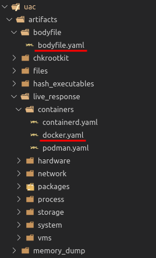

# Collectors

## command collector

Use this collector to run commands and store the output into an output file.

```yaml
artifacts:
  -
    description: Report a snapshot of the current processes.
    supported_os: [all]
    collector: command
    command: ps
    output_file: ps.txt
  -
    description: Report a snapshot of the current processes.
    supported_os: [aix, freebsd, linux, macos, netbsd, openbsd, solaris]
    collector: command
    command: ps auxwww
    output_file: ps_auxwww.txt
  -
    description: Extract strings from running processes.
    supported_os: [aix]
    collector: command
    loop_command: for pid in /proc/[0-9]*; do echo ${pid} | sed -e 's:/proc/::'; done
    command: strings -a /proc/%line%/object/a.out
    output_directory: proc/%line%
    output_file: strings.txt
    compress_output_file: true
```

### command
<span class="required">Required</span>

The command that will be run in the target system and the output will be collected from.

The path to the executable is not required. Only the name of the executable and the parameters should be given.

UAC can also run executables located in the ```bin``` directory. Even in this case the path to the executable is not required. The ```bin``` directory is always added to PATH when UAC starts. Please refer to ```bin/README.md``` file for more information.

The example below shows how to collect the output from ```ps -ef``` command:

```yaml
artifacts:
  -
    description: Report a snapshot of the current processes.
    supported_os: [all]
    collector: command
    command: ps -ef
    output_file: ps_-ef.txt
```

### loop_command
<span class="optional">Optional</span>

The command that will be run and the output lines will be used as the input for the [command](#command) option.

The logic behind it is:

```
for (each line returned by loop_command); do
  command
done
```

There is one variable that can be used that will be replaced by UAC at runtime:

|VARIABLE NAME|DESCRIPTION|
|---|---|
|%line%|Replaced with each line returned by the execution of the loop_command command|

Let's suppose you need to collect containers logs, and you don't know the containers IDs. First you need to retrieve all the IDs: ```docker container ps -all | sed 1d | awk '{print $1}'```

The ```%line%``` variable will be replaced by each output line resulted from that command (which are containers IDs in the example above).

This means if you have 10 containers, the command ```docker container logs %line%``` will be run 10 times, one for each container ID. Example:

```yaml
artifacts:
  -
    description: Fetch the logs of all containers.
    supported_os: [linux]
    collector: command
    loop_command: docker container ps -all | sed 1d | awk '{print $1}'
    command: docker container logs %line%
    output_file: docker_container_logs_%line%.txt
```

### output_file
<span class="required">Required</span>

Output file name where collected data will be stored in. UAC never overwrites output files. Data will be appended to file if the same file name is set for a different artifact rule within the same artifact directory.

Both ```ps``` and ```ps auxwww``` outputs will be stored into the same ```ps.txt``` file in the example below.

```yaml
artifacts:
  -
    description: Report a snapshot of the current processes.
    supported_os: [all]
    collector: command
    command: ps
    output_file: ps.txt
  -
    description: Report a snapshot of the current processes.
    supported_os: [all]
    collector: command
    command: ps auxwww
    output_file: ps.txt
```

### output_directory
<span class="optional">Optional</span>

Defines the subdirectory name the output file will be stored in.

By default, collected artifacts will always be stored into a directory which its path follows the same structure defined in the artifacts directory.

In the example below, the output file created by ```bodyfile.yaml``` will be stored into ```bodyfile``` directory, and the output files created by ```docker.yaml``` will be stored into ```live_response/containers``` directory.



But in some cases it is preferred to have the output file stored into subdirectories. Let's use the ```live_response/process/string_running_processes.yaml``` as an example where the output file is stored into ```live_response/process/proc/%line%``` subdirectory. 

```yaml
artifacts:
  -
    description: Extract strings from running processes.
    supported_os: [android, linux, netbsd]
    collector: command
    loop_command: for pid in /proc/[0-9]*; do echo ${pid} | sed -e 's:/proc/::'; done
    command: strings -a /proc/%line%/exe
    output_directory: proc/%line%
    output_file: strings.txt
    compress_output_file: true
```

### compressed_output_file
<span class="optional">Optional</span>

The output file will be compressed by gzip if this option is set to ```true```.

The following artifact will have its output stored into the compressed output file ```ps_-ef.txt.gz``` in the example below.

```yaml
artifacts:
  -
    description: Report a snapshot of the current processes.
    supported_os: [all]
    collector: command
    command: ps -ef
    output_file: ps_-ef.txt
    compress_output_file: true
```

### exclude_nologin_users
<span class="optional">Optional</span>

Use this option to search artifacts from users that have a valid shell only. Any user that has no shell or a shell set as false, halt, nologin, shutdown or sync will be skipped from the collection.

```yaml
artifacts:
  -
    description: Run 'ls -lRa' on all home directories for users that have a valid shell only.
    supported_os: [all]
    collector: command
    command: ls -lRa /%user_home%/
    exclude_nologin_users: true
    output_file: ls_-lRa_%user%.txt
```

## find collector

Use this collector to find files and directories using either ```find``` or ```find.pl``` tool, and store the output into a text file. 

```yaml
artifacts:
  -
    description: Find files that contain at least +x flag set for other.
    supported_os: [all]
    collector: find
    path: /
    exclude_file_system: [proc, procfs]
    file_type: f
    max_depth: 4
    max_file_size: 3072000
    permissions: -001
    output_file: list_of_executable_files.txt

```

### path
<span class="required">Required</span>

The starting point from where the artifact will be searched for. UAC will recurse into subdirectories unless otherwise prevented by ```max_depth``` option.

As UAC uses ```find``` tool to search for artifacts, wildcards and regex patterns are also supported here.

Every artifact should be treated like it originates on the / (root) mount point. The root mount point will be replaced by UAC if a new mount point is set with ```--mount-point``` command line option.

```yaml
artifacts:
  -
    description: Search all cmdline files within /proc/*/
    supported_os: [all]
    collector: find
    path: /proc/*/cmdline
    output_file: cmdline.txt
```

For keeping consistences across all supported operating systems (and different ```find``` tool versions), it is recommended that all directory names ends with a ```/*``` (slash asterisks).

Search all files and directories within ```/etc```. Note the use of a ```*``` at the end of the path.

```yaml
artifacts:
  -
    description: Search all files and directories within /etc.
    supported_os: [all]
    collector: find
    path: /etc/*
    output_file: etc.txt
```

Note that you need to use quotation marks when specifying paths with spaces.

```yaml
artifacts:
  -
    description: Search for TCC.db file.
    supported_os: [all]
    collector: find
    path: /Library/"Application Support"/com.apple.TCC/TCC.db
    output_file: path_with_spaces.txt
```

### path_pattern
<span class="optional">Optional</span>

Return the full file path if one of path_pattern values matches the file path. This option works exactly the same way as find's -path option.

Don't forget to enclose the pattern in double quotes. Use backslash (\\) to escape double quotes and commas.

As UAC uses ```find``` tool to search for artifacts, wildcards and regex patterns are also supported here.

The example below searches for Discord's Cache directory anywhere within the user's home directory. Hits would be as follows:

- /home/user/.config<span style="color: red;">/discord/Cache/</span>00bcecbd2455cb22_0
- /home/user/.var/app/com.discordapp.Discord/config<span style="color: red;">/discord/Cache/</span>index
- /home/user/snap/discord/current/.config<span style="color: red;">/discord/Cache/</span>ac0fa118bdaaa62e_0

```yaml
artifacts:
  -
    description: Find Discord cache files.
    supported_os: [all]
    collector: find
    path: /%user_home%
    path_pattern: ["*/discord/Cache/*"]
    output_file: discord_cache.txt
```

### name_pattern
<span class="optional">Optional</span>

Return the full file path if one of the name_pattern values matches the file name. This option works exactly the same way as find's -name option.

Because the leading directories are removed, the file names considered for a match with name_pattern will never include a slash, so ```"a/b"``` will never match anything.

Don't forget to enclose the pattern in double quotes. Use backslash (\\) to escape double quotes and commas.

```yaml
artifacts:
  -
    description: Search all wtmp and utmp files.
    supported_os: [all]
    collector: find
    path: /var/*
    name_pattern: ["wtmp", "btmp"]
    output_file: wtmp_btmp.txt
```

As UAC uses ```find``` tool to search for artifacts, wildcards and regex patterns are also supported here.

```yaml
artifacts:
  -
    description: Search all HTML and TXT files.
    supported_os: [all]
    collector: find
    path: /*
    name_pattern: ["*.html", "*.txt"]
    output_file: all_html_txt.txt
```

```yaml
artifacts:
  -
    description: Search all .log and .Log (capital L) files.
    supported_os: [all]
    collector: find
    path: /var/log/*
    name_pattern: ["*.[Ll]og"]
    output_file: all_log_files.txt
```

### exclude_path_pattern
<span class="optional">Optional</span>

Use this option to exclude paths from the collection. This option works exactly the same way as find's -path -prune option.

Don't forget to enclose the pattern in double quotes. Use backslash (\\) to escape double quotes and commas.

As UAC uses ```find``` tool to search for artifacts, wildcards and regex patterns are also supported here.

```yaml
artifacts:
  -
    description: Search all excluding /etc and /var.
    supported_os: [all]
    collector: find
    path: /*
    exclude_path_pattern: ["/dev", "/var"]
    output_file: all_excluding_etc_var.txt
```

### exclude_name_pattern
<span class="optional">Optional</span>

Use this option to exclude files from the collection. This option works exactly the same way as find's -name -prune option.

Because the leading directories are removed, the file names considered for a match with exclude_name_pattern will never include a slash, so ```"a/b"``` will never match anything.

Don't forget to enclose the pattern in double quotes. Use backslash (\\) to escape double quotes and commas.

As UAC uses ```find``` tool to search for artifacts, wildcards and regex patterns are also supported here.

```yaml
artifacts:
  -
    description: Search /etc excluding passwd and shadow* files.
    supported_os: [all]
    collector: find
    path: /etc/*
    exclude_name_pattern: ["passwd", "shadow*"]
    output_file: etc_excluding_passwd_shadow.txt
```

### exclude_file_system
<span class="optional">Optional</span>

Use this option to exclude file systems from the collection. UAC will retrieve the list of existing mountpoints (paths) and exclude them from the collection.

The file system types which are supported depend on the target computer's running kernel.

```yaml
artifacts:
  -
    description: Search all files excluding any files located in procfs, nfs and devfs file systems.
    supported_os: [all]
    collector: find
    path: /*
    exclude_file_system: [procfs, nfs, devfs]
    output_file: exclude_procfs_nfs_devfs.txt
```

### max_depth
<span class="optional">Optional</span>

Descend at most levels (a non-negative integer) levels of directories below the starting-point. Using 0 means only apply the tests and actions to the starting-points themselves. This option works exactly the same way as find's -maxdepth option.

```yaml
artifacts:
  -
    description: Descend at most 5 levels of directories below /.
    supported_os: [all]
    collector: find
    path: /*
    max_depth: 5
    output_file: max_5_levels.txt
```

### file_type
<span class="optional">Optional</span>

This option works exactly the same way as find's -type option.

File is of type:

|Value|Description|
|---|---|
|f|regular file|
|d|directory|
|l|symbolic link
|p|named pipe (FIFO)|
|s|socket|
|b|block special|
|c|character special|

```yaml
artifacts:
  -
    description: Search files only.
    supported_os: [all]
    collector: find
    path: /*
    file_type: f
    output_file: files_only.txt
```

```yaml
artifacts:
  -
    description: Search directories only.
    supported_os: [all]
    collector: find
    path: /*
    file_type: d
    output_file: directories_only.txt
```

### min_file_size
<span class="optional">Optional</span>

The minimum size of a file to search, in bytes. Any files smaller than this will be ignored.

```yaml
artifacts:
  -
    description: Search all files bigger than 1048576 bytes.
    supported_os: [all]
    collector: find
    path: /*
    file_type: f
    min_file_size: 1048576
    output_file: bigger_than.txt
```

### max_file_size
<span class="optional">Optional</span>

The maximum size of a file to search, in bytes. Any files bigger than this will be ignored.

```yaml
artifacts:
  -
    description: Search all files smaller than 1048576 bytes.
    supported_os: [all]
    collector: find
    path: /*
    file_type: f
    max_file_size: 1048576
    output_file: smaller_than.txt
```

### permissions
<span class="optional">Optional</span>

Use this option to search for files and directories based on their permissions. This option works exactly the same way as find's -perm option.

Please note that symbolic mode is not supported (e.g: -g=w).

Permissions can be used as follows:

- File's permission bits are exactly ```mode``` (octal).

```yaml
artifacts:
  -
    description: Search files that have permissions set to 755.
    supported_os: [all]
    collector: find
    path: /*
    file_type: f
    permissions: 755
    output_file: all_755_permissions.txt
```

- All of the permission bits ```mode``` (octal) are set for the file.

```yaml
artifacts:
  -
    description: Search for files that have SUID bit set.
    supported_os: [all]
    collector: find
    path: /*
    file_type: f
    permissions: -4000
    output_file: suid_files.txt
```

### ignore_date_range
<span class="optional">Optional</span>

Use this option to collect files ignoring the date set using both --date-range-start and --date-range-end command line options.

This is useful when you want to set a date range for your collection, but want to collect some files regardless their last accessed, modified and changed dates.

Example, search for all files and subdirecties from /etc regardless their last accessed, modified and changed dates, even if a date range was set using --date-range-start and --date-range-end command line options.

```yaml
artifacts:
  -
    description: Search /etc regardless date range set by --date-range-start and --date-range-end.
    supported_os: [all]
    collector: find
    path: /etc/*
    ignore_date_range: true
    output_file: ignore_date_range.txt
```

### exclude_nologin_users
<span class="optional">Optional</span>

Use this option to search artifacts from users that have a valid shell only. Any user that has no shell or a shell set as false, halt, nologin, shutdown or sync will be skipped from the collection.

```yaml
artifacts:
  -
    description: Collect .bash_history file from users that have a valid shell only.
    supported_os: [all]
    collector: find
    path: /%user_home%/.bash_history
    exclude_nologin_users: true
    output_file: exclude_nologin_users.txt
```

### output_file
<span class="required">Required</span>

Output file name where the list of files will be stored in. UAC never overwrites output files. Data will be appended to file if the same file name is set for a different artifact rule within the same artifact directory.

```yaml
artifacts:
  -
    description: Search all files and directories from /etc.
    supported_os: [all]
    collector: find
    path: /etc/*
    output_file: same_output_file.txt
  -
    description: Search all files and directories from /var/log.
    supported_os: [all]
    collector: find
    path: /var/log/*
    output_file: same_output_file.txt
```

### output_directory
<span class="optional">Optional</span>

Defines the subdirectory name the output file will be stored in.

By default, collected artifacts will always be stored into a directory which its path follows the same structure defined in the artifacts directory.

In the example below, the output file created by ```bodyfile.yaml``` will be stored into ```bodyfile``` directory, and the output files created by ```docker.yaml``` will be stored into ```live_response/containers``` directory.


But in some cases it is preferred to have the output file stored into subdirectories. Let's use the ```live_response/process/string_running_processes.yaml``` as an example where the output file is stored into ```live_response/process/proc/%line%``` subdirectory. 

```yaml
artifacts:
  -
    description: Extract strings from running processes.
    supported_os: [android, linux, netbsd]
    collector: command
    loop_command: for pid in /proc/[0-9]*; do echo ${pid} | sed -e 's:/proc/::'; done
    command: strings -a /proc/%line%/exe
    output_directory: proc/%line%
    output_file: strings.txt
    compress_output_file: true
```

## hash collector

Use this collector to hash files and store the output into a text file. Hash algorithms that will be used during collection are defined in ```config/uac.conf``` file.

```yaml
artifacts:
  -
    description: Hash all files smaller than 3072000 bytes.
    supported_os: [all]
    collector: hash
    path: /*
    exclude_file_system: [proc, procfs]
    file_type: f
    max_depth: 4
    max_file_size: 3072000
    output_file: hash.txt

```

### path
<span class="required">Required</span>

The starting point from where the files will be searched for. UAC will recurse into subdirectories unless otherwise prevented by ```max_depth``` option.

As UAC uses ```find``` tool to search for artifacts, wildcards and regex patterns are also supported here.

Every file should be treated like it originates on the / (root) mount point. The root mount point will be replaced by UAC if a new mount point is set with ```--mount-point``` command line option.

```yaml
artifacts:
  -
    description: Hash /bin/sh file.
    supported_os: [all]
    collector: hash
    path: /bin/sh
    output_file: hash_bin_sh.txt
```

For keeping consistences across all supported operating systems (and different ```find``` tool versions), it is recommended that all directory names ends with a ```/*``` (slash asterisks).

Hash all files  within ```/etc```. Note the use of a ```*``` at the end of the path.

```yaml
artifacts:
  -
    description: Hash all files and directories within /etc.
    supported_os: [all]
    collector: hash
    path: /etc/*
    output_file: hashes_etc.txt
```

Note that you need to use quotation marks when specifying paths with spaces.

```yaml
artifacts:
  -
    description: Hash TCC.db file.
    supported_os: [all]
    collector: hash
    path: /Library/"Application Support"/com.apple.TCC/TCC.db
    output_file: path_with_spaces.txt
```

### is_file_list
<span class="optional">Optional</span>

If set to true, the ```path``` option will refer to a file list containing one path per line. This is useful when you need to hash files based on a file list.

```yaml
artifacts:
  -
    description: Hash files based on a file list located in /%uac_directory%/my_file_list.txt.
    supported_os: [all]
    collector: hash
    path: /%uac_directory%/my_file_list.txt
    is_file_list: true
    output_file: hash_my_file_list.txt
```

### path_pattern
<span class="optional">Optional</span>

Return the full file path if one of path_pattern values matches the file path. This option works exactly the same way as find's -path option.

Don't forget to enclose the pattern in double quotes. Use backslash (\\) to escape double quotes and commas.

As UAC uses ```find``` tool to search for artifacts, wildcards and regex patterns are also supported here.

The example below searches for Discord's Cache directory anywhere within the user's home directory. Hits would be as follows:

- /home/user/.config<span style="color: red;">/discord/Cache/</span>00bcecbd2455cb22_0
- /home/user/.var/app/com.discordapp.Discord/config<span style="color: red;">/discord/Cache/</span>index
- /home/user/snap/discord/current/.config<span style="color: red;">/discord/Cache/</span>ac0fa118bdaaa62e_0

```yaml
artifacts:
  -
    description: Find Discord cache files.
    supported_os: [all]
    collector: hash
    path: /%user_home%
    path_pattern: ["*/discord/Cache/*"]
    output_file: discord_cache
```

### name_pattern
<span class="optional">Optional</span>

Return the full file path if one of the values of name_pattern matches the file name. This option works exactly the same way as find's -name option.

Because the leading directories are removed, the file names considered for a match with name_pattern will never include a slash, so ```"a/b"``` will never match anything.

Don't forget to enclose the pattern in double quotes. Use backslash (\\) to escape double quotes and commas.

```yaml
artifacts:
  -
    description: Hash all wtmp and utmp files.
    supported_os: [all]
    collector: hash
    path: /var/*
    name_pattern: ["wtmp", "btmp"]
    output_file: hash_wtmp_btmp.txt
```

As UAC uses ```find``` tool to search for artifacts, wildcards and regex patterns are also supported here.

```yaml
artifacts:
  -
    description: Hash all HTML and TXT files.
    supported_os: [all]
    collector: hash
    path: /*
    name_pattern: ["*.html", "*.txt"]
    output_file: hash_all_html_txt
```

```yaml
artifacts:
  -
    description: Hash all .log and .Log (capital L) files.
    supported_os: [all]
    collector: hash
    path: /var/log/*
    name_pattern: ["*.[Ll]og"]
    output_file: hash_all_log_files
```

### exclude_path_pattern
<span class="optional">Optional</span>

Use this option to exclude paths from the collection. This option works exactly the same way as find's -path -prune option.

Don't forget to enclose the pattern in double quotes. Use backslash (\\) to escape double quotes and commas.

As UAC uses ```find``` tool to search for artifacts, wildcards and regex patterns are also supported here.

```yaml
artifacts:
  -
    description: Hash all files excluding /etc and /var.
    supported_os: [all]
    collector: hash
    path: /*
    exclude_path_pattern: ["/dev", "/var"]
    output_file: all_excluding_etc_var.txt
```

### exclude_name_pattern
<span class="optional">Optional</span>

Use this option to exclude files from the collection. This option works exactly the same way as find's -name -prune option.

Because the leading directories are removed, the file names considered for a match with exclude_name_pattern will never include a slash, so ```"a/b"``` will never match anything.

Don't forget to enclose the pattern in double quotes. Use backslash (\\) to escape double quotes and commas.

As UAC uses ```find``` tool to search for artifacts, wildcards and regex patterns are also supported here.

```yaml
artifacts:
  -
    description: Hash all from /etc excluding passwd and shadow* files.
    supported_os: [all]
    collector: hash
    path: /etc/*
    exclude_name_pattern: ["passwd", "shadow*"]
    output_file: hash_etc_excluding_passwd_shadow.txt
```

### exclude_file_system
<span class="optional">Optional</span>

Use this option to exclude file systems from the collection. UAC will retrieve the list of existing mountpoints (paths) and exclude them from the collection.

The file system types which are supported depend on the target computer's running kernel.

```yaml
artifacts:
  -
    description: Hash all files excluding any files located in procfs, nfs and devfs file systems.
    supported_os: [all]
    collector: hash
    path: /*
    exclude_file_system: [procfs, nfs, devfs]
    file_type: f
    output_file: hash_all_exclude_procfs_nfs_devfs.txt
```

### max_depth
<span class="optional">Optional</span>

Descend at most levels (a non-negative integer) levels of directories below the starting-point. Using 0 means only apply the tests and actions to the starting-points themselves. This option works exactly the same way as find's -maxdepth option.

```yaml
artifacts:
  -
    description: Descend at most 5 levels of directories below /.
    supported_os: [all]
    collector: hash
    path: /*
    max_depth: 5
    output_file: hash_max_5_levels.txt
```

### file_type
<span class="optional">Optional</span>

This option works exactly the same way as find's -type option.

File is of type:

|Value|Description|
|---|---|
|f|regular file|
|d|directory|
|l|symbolic link
|p|named pipe (FIFO)|
|s|socket|
|b|block special|
|c|character special|

```yaml
artifacts:
  -
    description: Hash files only
    supported_os: [all]
    collector: find
    path: /*
    file_type: f
    output_file: files_only.txt
```

### min_file_size
<span class="optional">Optional</span>

The minimum size of a file to hash, in bytes. Any files smaller than this will be ignored.

```yaml
artifacts:
  -
    description: Hash all files bigger than 1048576 bytes
    supported_os: [all]
    collector: hash
    path: /*
    file_type: f
    min_file_size: 1048576
    output_file: hash_bigger_than.txt
```

### max_file_size
<span class="optional">Optional</span>

The maximum size of a file to hash, in bytes. Any files bigger than this will be ignored.

```yaml
artifacts:
  -
    description: Hash all files smaller than 1048576 bytes
    supported_os: [all]
    collector: hash
    path: /*
    file_type: f
    max_file_size: 1048576
    output_file: hash_smaller_than.txt
```

### permissions
<span class="optional">Optional</span>

Use this option to hash files based on their permissions. This option works exactly the same way as find's -perm option.

Please note that symbolic mode is not supported (e.g: -g=w).

Permissions can be used as follows:

- File's permission bits are exactly ```mode``` (octal).

```yaml
artifacts:
  -
    description: Hash files that have permissions set to 755.
    supported_os: [all]
    collector: hash
    path: /*
    file_type: f
    permissions: 755
    output_file: hash_all_755_permissions.txt
```

- All of the permission bits ```mode``` (octal) are set for the file.

```yaml
artifacts:
  -
    description: Hash all files that have SUID bit set.
    supported_os: [all]
    collector: hash
    path: /*
    file_type: f
    permissions: -4000
    output_file: hash_suid_files.txt
```

### ignore_date_range
<span class="optional">Optional</span>

Use this option to hash files ignoring the date set using both --date-range-start and --date-range-end command line options.

This is useful when you want to set a date range for your collection, but want to hash some files regardless their last accessed, modified and changed dates.

Example, hash for all files and subdirecties from /etc regardless their last accessed, modified and changed dates, even if a date range was set using --date-range-start and --date-range-end command line options.

```yaml
artifacts:
  -
    description: Hash all files from /etc regardless date range set by --date-range-start and --date-range-end.
    supported_os: [all]
    collector: hash
    path: /etc/*
    ignore_date_range: true
    output_file: hash_ignore_date_range.txt
```

### exclude_nologin_users
<span class="optional">Optional</span>

Use this option to hash files from users that have a valid shell only. Any user that has no shell or a shell set as false, halt, nologin, shutdown or sync will be skipped from the collection.

```yaml
artifacts:
  -
    description: Hash .bash_history file from users that have a valid shell only.
    supported_os: [all]
    collector: hash
    path: /%user_home%/.bash_history
    exclude_nologin_users: true
    output_file: hash_exclude_nologin_users.txt
```

### output_file
<span class="required">Required</span>

Output file name where the hashes will be stored in. UAC never overwrites output files. Data will be appended to file if the same file name is set for a different artifact rule within the same artifact directory.

The proper file extension (.md5, .sha1 or .sha256) will be added automatically to the output file according to the hash algorithm used to hash the files. In the example below, the output file will be ```same_output_file.txt.md5``` and ```same_output_file.txt.sha256``` if MD5 and SHA256 algorithms were set in ```config/uac.conf``` file.

```yaml
artifacts:
  -
    description: Hash all files and directories from /etc.
    supported_os: [all]
    collector: hash
    path: /etc/*
    output_file: same_output_file.txt
  -
    description: Hash all files and directories from /var/log.
    supported_os: [all]
    collector: hash
    path: /var/log/*
    output_file: same_output_file.txt
```

### output_directory
<span class="optional">Optional</span>

Defines the subdirectory name the output file will be stored in.

By default, collected artifacts will always be stored into a directory which its path follows the same structure defined in the artifacts directory.

In the example below, the output file created by ```bodyfile.yaml``` will be stored into ```bodyfile``` directory, and the output files created by ```docker.yaml``` will be stored into ```live_response/containers``` directory.


But in some cases it is preferred to have the output file stored into subdirectories. Let's use the ```live_response/process/string_running_processes.yaml``` as an example where the output file is stored into ```live_response/process/proc/%line%``` subdirectory. 

```yaml
artifacts:
  -
    description: Extract strings from running processes.
    supported_os: [android, linux, netbsd]
    collector: command
    loop_command: for pid in /proc/[0-9]*; do echo ${pid} | sed -e 's:/proc/::'; done
    command: strings -a /proc/%line%/exe
    output_directory: proc/%line%
    output_file: strings.txt
    compress_output_file: true
```

## stat collector

Use this collector to extract information from files and directories using either ```stat``` or ```stat.pl``` tool to create a body file. The body file is an intermediate file when creating a timeline of file activity. It is a pipe ("|") delimited text file that contains one line for each file. [Plaso](https://github.com/log2timeline/plaso) and [mactime](https://wiki.sleuthkit.org/index.php?title=Mactime) tools can be used to read this file and sorts the contents.

```yaml
artifacts:
  -
    description: Stat all files.
    supported_os: [all]
    collector: stat
    path: /*
    file_type: f
    output_file: stat.txt

```

### path
<span class="required">Required</span>

The starting point from where the files will be searched for. UAC will recurse into subdirectories unless otherwise prevented by ```max_depth``` option.

As UAC uses ```find``` tool to search for artifacts, wildcards and regex patterns are also supported here.

Every file should be treated like it originates on the / (root) mount point. The root mount point will be replaced by UAC if a new mount point is set with ```--mount-point``` command line option.

```yaml
artifacts:
  -
    description: Stat /bin/sh file.
    supported_os: [all]
    collector: stat
    path: /bin/sh
    output_file: stat_bin_sh.txt
```

For keeping consistences across all supported operating systems (and different ```find``` tool versions), it is recommended that all directory names ends with a ```/*``` (slash asterisks).

Stat all files  within ```/etc```. Note the use of a ```*``` at the end of the path.

```yaml
artifacts:
  -
    description: Stat all files and directories within /etc.
    supported_os: [all]
    collector: stat
    path: /etc/*
    output_file: stat_etc.txt
```

Note that you need to use quotation marks when specifying paths with spaces.

```yaml
artifacts:
  -
    description: Stat TCC.db file.
    supported_os: [all]
    collector: stat
    path: /Library/"Application Support"/com.apple.TCC/TCC.db
    output_file: path_with_spaces.txt
```

### is_file_list
<span class="optional">Optional</span>

If set to true, the ```path``` option will refer to a file list containing one path per line. This is useful when you need to stat files based on a file list.

```yaml
artifacts:
  -
    description: Stat files based on a file list located in /%uac_directory%/my_file_list.txt.
    supported_os: [all]
    collector: stat
    path: /%uac_directory%/my_file_list.txt
    is_file_list: true
    output_file: stat_my_file_list.txt
```

### path_pattern
<span class="optional">Optional</span>

Return the full file path if one of path_pattern values matches the file path. This option works exactly the same way as find's -path option.

Don't forget to enclose the pattern in double quotes. Use backslash (\\) to escape double quotes and commas.

As UAC uses ```find``` tool to search for artifacts, wildcards and regex patterns are also supported here.

The example below searches for Discord's Cache directory anywhere within the user's home directory. Hits would be as follows:

- /home/user/.config<span style="color: red;">/discord/Cache/</span>00bcecbd2455cb22_0
- /home/user/.var/app/com.discordapp.Discord/config<span style="color: red;">/discord/Cache/</span>index
- /home/user/snap/discord/current/.config<span style="color: red;">/discord/Cache/</span>ac0fa118bdaaa62e_0

```yaml
artifacts:
  -
    description: Find Discord cache files.
    supported_os: [all]
    collector: stat
    path: /%user_home%
    path_pattern: ["*/discord/Cache/*"]
    output_file: discord_cache.txt
```

### name_pattern
<span class="optional">Optional</span>

Return the full file path if one of the values of name_pattern matches the file name. This option works exactly the same way as find's -name option.

Because the leading directories are removed, the file names considered for a match with name_pattern will never include a slash, so ```"a/b"``` will never match anything.

Don't forget to enclose the pattern in double quotes. Use backslash (\\) to escape double quotes and commas.

```yaml
artifacts:
  -
    description: Stat all wtmp and utmp files.
    supported_os: [all]
    collector: stat
    path: /var/*
    name_pattern: ["wtmp", "btmp"]
    output_file: stat_wtmp_btmp.txt
```

As UAC uses ```find``` tool to search for artifacts, wildcards and regex patterns are also supported here.

```yaml
artifacts:
  -
    description: Stat all HTML and TXT files.
    supported_os: [all]
    collector: stat
    path: /*
    name_pattern: ["*.html", "*.txt"]
    output_file: stat_all_html_txt
```

```yaml
artifacts:
  -
    description: Stat all .log and .Log (capital L) files.
    supported_os: [all]
    collector: stat
    path: /var/log/*
    name_pattern: ["*.[Ll]og"]
    output_file: stat_all_log_files
```

### exclude_path_pattern
<span class="optional">Optional</span>

Use this option to exclude paths from the collection. This option works exactly the same way as find's -path -prune option.

Don't forget to enclose the pattern in double quotes. Use backslash (\\) to escape double quotes and commas.

As UAC uses ```find``` tool to search for artifacts, wildcards and regex patterns are also supported here.

```yaml
artifacts:
  -
    description: Stat all files excluding /etc and /var.
    supported_os: [all]
    collector: stat
    path: /*
    exclude_path_pattern: ["/dev", "/var"]
    output_file: stat_all_excluding_etc_var.txt
```

### exclude_name_pattern
<span class="optional">Optional</span>

Use this option to exclude files from the collection. This option works exactly the same way as find's -name -prune option.

Because the leading directories are removed, the file names considered for a match with exclude_name_pattern will never include a slash, so ```"a/b"``` will never match anything.

Don't forget to enclose the pattern in double quotes. Use backslash (\\) to escape double quotes and commas.

As UAC uses ```find``` tool to search for artifacts, wildcards and regex patterns are also supported here.

```yaml
artifacts:
  -
    description: Stat all from /etc excluding passwd and shadow* files.
    supported_os: [all]
    collector: stat
    path: /etc/*
    exclude_name_pattern: ["passwd", "shadow*"]
    output_file: stat_etc_excluding_passwd_shadow.txt
```

### exclude_file_system
<span class="optional">Optional</span>

Use this option to exclude file systems from the collection. UAC will retrieve the list of existing mountpoints (paths) and exclude them from the collection.

The file system types which are supported depend on the target computer's running kernel.

```yaml
artifacts:
  -
    description: Stat all files excluding any files located in procfs, nfs and devfs file systems.
    supported_os: [all]
    collector: stat
    path: /*
    exclude_file_system: [procfs, nfs, devfs]
    file_type: f
    output_file: stat_all_exclude_procfs_nfs_devfs.txt
```

### max_depth
<span class="optional">Optional</span>

Descend at most levels (a non-negative integer) levels of directories below the starting-point. Using 0 means only apply the tests and actions to the starting-points themselves. This option works exactly the same way as find's -maxdepth option.

```yaml
artifacts:
  -
    description: Descend at most 5 levels of directories below /.
    supported_os: [all]
    collector: stat
    path: /*
    max_depth: 5
    output_file: stat_max_5_levels.txt
```

### file_type
<span class="optional">Optional</span>

This option works exactly the same way as find's -type option.

File is of type:

|Value|Description|
|---|---|
|f|regular file|
|d|directory|
|l|symbolic link
|p|named pipe (FIFO)|
|s|socket|
|b|block special|
|c|character special|

```yaml
artifacts:
  -
    description: Stat files only.
    supported_os: [all]
    collector: stat
    path: /*
    file_type: f
    output_file: stat_files_only.txt
```

```yaml
artifacts:
  -
    description: Stat directories only.
    supported_os: [all]
    collector: stat
    path: /*
    file_type: d
    output_file: stat_directories_only.txt
```

### min_file_size
<span class="optional">Optional</span>

The minimum size of a file to stat, in bytes. Any files smaller than this will be ignored.

```yaml
artifacts:
  -
    description: Stat all files bigger than 1048576 bytes.
    supported_os: [all]
    collector: stat
    path: /*
    file_type: f
    min_file_size: 1048576
    output_file: stat_bigger_than.txt
```

### max_file_size
<span class="optional">Optional</span>

The maximum size of a file to stat, in bytes. Any files bigger than this will be ignored.

```yaml
artifacts:
  -
    description: Stat all files smaller than 1048576 bytes.
    supported_os: [all]
    collector: stat
    path: /*
    file_type: f
    max_file_size: 1048576
    output_file: stat_smaller_than.txt
```

### permissions
<span class="optional">Optional</span>

Use this option to stat files based on their permissions. This option works exactly the same way as find's -perm option.

Please note that symbolic mode is not supported (e.g: -g=w).

Permissions can be used as follows:

- File's permission bits are exactly ```mode``` (octal).

```yaml
artifacts:
  -
    description: Stat files that have permissions set to 755.
    supported_os: [all]
    collector: stat
    path: /*
    file_type: f
    permissions: 755
    output_file: stat_all_755_permissions.txt
```

- All of the permission bits ```mode``` (octal) are set for the file.

```yaml
artifacts:
  -
    description: Stat all files that have SUID bit set.
    supported_os: [all]
    collector: stat
    path: /*
    file_type: f
    permissions: -4000
    output_file: stat_suid_files.txt
```

### ignore_date_range
<span class="optional">Optional</span>

Use this option to stat files ignoring the date set using both --date-range-start and --date-range-end command line options.

This is useful when you want to set a date range for your collection, but want to stat some files regardless their last accessed, modified and changed dates.

Example, stat for all files and subdirecties from /etc regardless their last accessed, modified and changed dates, even if a date range was set using --date-range-start and --date-range-end command line options.

```yaml
artifacts:
  -
    description: Stat all files from /etc regardless date range set by --date-range-start and --date-range-end.
    supported_os: [all]
    collector: stat
    path: /etc/*
    ignore_date_range: true
    output_file: stat_ignore_date_range.txt
```

### exclude_nologin_users
<span class="optional">Optional</span>

Use this option to stat files from users that have a valid shell only. Any user that has no shell or a shell set as false, halt, nologin, shutdown or sync will be skipped from the collection.

```yaml
artifacts:
  -
    description: Stat .bash_history file from users that have a valid shell only.
    supported_os: [all]
    collector: stat
    path: /%user_home%/.bash_history
    exclude_nologin_users: true
    output_file: stat_exclude_nologin_users.txt
```

### output_file
<span class="required">Required</span>

Output file name where the stat information will be stored in. UAC never overwrites output files. Data will be appended to file if the same file name is set for a different artifact rule within the same artifact directory.

```yaml
artifacts:
  -
    description: Stat all files and directories from /etc.
    supported_os: [all]
    collector: stat
    path: /etc/*
    output_file: same_output_file.txt
  -
    description: Stat all files and directories from /var/log.
    supported_os: [all]
    collector: stat
    path: /var/log/*
    output_file: same_output_file.txt
```

### output_directory
<span class="optional">Optional</span>

Defines the subdirectory name the output file will be stored in.

By default, collected artifacts will always be stored into a directory which its path follows the same structure defined in the artifacts directory.

In the example below, the output file created by ```bodyfile.yaml``` will be stored into ```bodyfile``` directory, and the output files created by ```docker.yaml``` will be stored into ```live_response/containers``` directory.


But in some cases it is preferred to have the output file stored into subdirectories. Let's use the ```live_response/process/string_running_processes.yaml``` as an example where the output file is stored into ```live_response/process/proc/%line%``` subdirectory. 

```yaml
artifacts:
  -
    description: Extract strings from running processes.
    supported_os: [android, linux, netbsd]
    collector: command
    loop_command: for pid in /proc/[0-9]*; do echo ${pid} | sed -e 's:/proc/::'; done
    command: strings -a /proc/%line%/exe
    output_directory: proc/%line%
    output_file: strings.txt
    compress_output_file: true
```

## file collector

Use this collector to collect files and directories.

```yaml
artifacts:
  -
    description: Collect all files within /var/log (recursive).
    supported_os: [all]
    collector: file
    path: /var/log/*
    file_type: f
```

### path
<span class="required">Required</span>

The starting point from where the files will be searched for. UAC will recurse into subdirectories unless otherwise prevented by ```max_depth``` option.

As UAC uses ```find``` tool to search for artifacts, wildcards and regex patterns are also supported here.

Every file should be treated like it originates on the / (root) mount point. The root mount point will be replaced by UAC if a new mount point is set with ```--mount-point``` command line option.

```yaml
artifacts:
  -
    description: Collect /bin/sh file.
    supported_os: [all]
    collector: file
    path: /bin/sh
```

For keeping consistences across all supported operating systems (and different ```find``` tool versions), it is recommended that all directory names ends with a ```/*``` (slash asterisks).

Collect all files from ```/etc```. Note the use of a ```*``` at the end of the path.

```yaml
artifacts:
  -
    description: Collect all files and directories within /etc.
    supported_os: [all]
    collector: file
    path: /etc/*
```

Note that you need to use quotation marks when specifying paths with spaces.

```yaml
artifacts:
  -
    description: Collect TCC.db file.
    supported_os: [all]
    collector: file
    path: /Library/"Application Support"/com.apple.TCC/TCC.db
```

### is_file_list
<span class="optional">Optional</span>

If set to true, the ```path``` option will refer to a file list containing one path per line. This is useful when you need to collect files based on a file list.

```yaml
artifacts:
  -
    description: Collect files based on a file list located in /%uac_directory%/my_file_list.txt.
    supported_os: [all]
    collector: file
    path: /%uac_directory%/my_file_list.txt
    is_file_list: true
```

### path_pattern
<span class="optional">Optional</span>

Return the full file path if one of path_pattern values matches the file path. This option works exactly the same way as find's -path option.

Don't forget to enclose the pattern in double quotes. Use backslash (\\) to escape double quotes and commas.

As UAC uses ```find``` tool to search for artifacts, wildcards and regex patterns are also supported here.

The example below searches for Discord's Cache directory anywhere within the user's home directory. Hits would be as follows:

- /home/user/.config<span style="color: red;">/discord/Cache/</span>00bcecbd2455cb22_0
- /home/user/.var/app/com.discordapp.Discord/config<span style="color: red;">/discord/Cache/</span>index
- /home/user/snap/discord/current/.config<span style="color: red;">/discord/Cache/</span>ac0fa118bdaaa62e_0

```yaml
artifacts:
  -
    description: Find Discord cache files.
    supported_os: [all]
    collector: file
    path: /%user_home%
    path_pattern: ["*/discord/Cache/*"]
```

### name_pattern
<span class="optional">Optional</span>

Return the full file path if one of the values of name_pattern matches the file name. This option works exactly the same way as find's -name option.

Because the leading directories are removed, the file names considered for a match with name_pattern will never include a slash, so ```"a/b"``` will never match anything.

Don't forget to enclose the pattern in double quotes. Use backslash (\\) to escape double quotes and commas.

```yaml
artifacts:
  -
    description: Collect all wtmp and utmp files.
    supported_os: [all]
    collector: file
    path: /var/*
    name_pattern: ["wtmp", "btmp"]
```

As UAC uses ```find``` tool to search for artifacts, wildcards and regex patterns are also supported here.

```yaml
artifacts:
  -
    description: Collect all HTML and TXT files.
    supported_os: [all]
    collector: file
    path: /*
    name_pattern: ["*.html", "*.txt"]
```

```yaml
artifacts:
  -
    description: Collect all .log and .Log (capital L) files.
    supported_os: [all]
    collector: file
    path: /var/log/*
    name_pattern: ["*.[Ll]og"]
```

### exclude_path_pattern
<span class="optional">Optional</span>

Use this option to exclude paths from the collection. This option works exactly the same way as find's -path -prune option.

Don't forget to enclose the pattern in double quotes. Use backslash (\\) to escape double quotes and commas.

As UAC uses ```find``` tool to search for artifacts, wildcards and regex patterns are also supported here.

```yaml
artifacts:
  -
    description: Collect all files excluding /etc and /var.
    supported_os: [all]
    collector: file
    path: /*
    exclude_path_pattern: ["/dev", "/var"]
```

### exclude_name_pattern
<span class="optional">Optional</span>

Use this option to exclude files from the collection. This option works exactly the same way as find's -name -prune option.

Because the leading directories are removed, the file names considered for a match with exclude_name_pattern will never include a slash, so ```"a/b"``` will never match anything.

Don't forget to enclose the pattern in double quotes. Use backslash (\\) to escape double quotes and commas.

As UAC uses ```find``` tool to search for artifacts, wildcards and regex patterns are also supported here.

```yaml
artifacts:
  -
    description: Collect all from /etc excluding passwd and shadow* files.
    supported_os: [all]
    collector: file
    path: /etc/*
    exclude_name_pattern: ["passwd", "shadow*"]
```

### exclude_file_system
<span class="optional">Optional</span>

Use this option to exclude file systems from the collection. UAC will retrieve the list of existing mountpoints (paths) and exclude them from the collection.

The file system types which are supported depend on the target computer's running kernel.

```yaml
artifacts:
  -
    description: Collect all files excluding any files located in procfs, nfs and devfs file systems.
    supported_os: [all]
    collector: file
    path: /*
    exclude_file_system: [procfs, nfs, devfs]
    file_type: f
```

### max_depth
<span class="optional">Optional</span>

Descend at most levels (a non-negative integer) levels of directories below the starting-point. Using 0 means only apply the tests and actions to the starting-points themselves. This option works exactly the same way as find's -maxdepth option.

```yaml
artifacts:
  -
    description: Descend at most 5 levels of directories below /.
    supported_os: [all]
    collector: file
    path: /*
    max_depth: 5
```

### file_type
<span class="optional">Optional</span>

This option works exactly the same way as find's -type option.

File is of type:

|Value|Description|
|---|---|
|f|regular file|
|d|directory|
|l|symbolic link
|p|named pipe (FIFO)|
|s|socket|
|b|block special|
|c|character special|

```yaml
artifacts:
  -
    description: Collect files only.
    supported_os: [all]
    collector: file
    path: /var/log/*
    file_type: f
```

### min_file_size
<span class="optional">Optional</span>

The minimum size of a file to stat, in bytes. Any files smaller than this will be ignored.

```yaml
artifacts:
  -
    description: Collect all files bigger than 1048576 bytes.
    supported_os: [all]
    collector: file
    path: /*
    file_type: f
    min_file_size: 1048576
```

### max_file_size
<span class="optional">Optional</span>

The maximum size of a file to stat, in bytes. Any files bigger than this will be ignored.

```yaml
artifacts:
  -
    description: Collect all files smaller than 1048576 bytes.
    supported_os: [all]
    collector: file
    path: /*
    file_type: f
    max_file_size: 1048576
```

### permissions
<span class="optional">Optional</span>

Use this option to collect files based on their permissions. This option works exactly the same way as find's -perm option.

Please note that symbolic mode is not supported (e.g: -g=w).

Permissions can be used as follows:

- File's permission bits are exactly ```mode``` (octal).

```yaml
artifacts:
  -
    description: Collect files that have permissions set to 755.
    supported_os: [all]
    collector: file
    path: /*
    file_type: f
    permissions: 755
```

- All of the permission bits ```mode``` (octal) are set for the file.

```yaml
artifacts:
  -
    description: Collect all files that have SUID bit set.
    supported_os: [all]
    collector: file
    path: /*
    file_type: f
    permissions: -4000
```

### ignore_date_range
<span class="optional">Optional</span>

Use this option to collect files ignoring the date set using both --date-range-start and --date-range-end command line options.

This is useful when you want to set a date range for your collection, but want to collect some files regardless their last accessed, modified and changed dates.

Example, collect all files and subdirecties from /etc regardless their last accessed, modified and changed dates, even if a date range was set using --date-range-start and --date-range-end command line options.

```yaml
artifacts:
  -
    description: Collect all files from /etc regardless date range set by --date-range-start and --date-range-end.
    supported_os: [all]
    collector: file
    path: /etc/*
    ignore_date_range: true
```

### exclude_nologin_users
<span class="optional">Optional</span>

Use this option to collect files from users that have a valid shell only. Any user that has no shell or a shell set as false, halt, nologin, shutdown or sync will be skipped from the collection.

```yaml
artifacts:
  -
    description: Collect .bash_history file from users that have a valid shell only.
    supported_os: [all]
    collector: file
    path: /%user_home%/.bash_history
    exclude_nologin_users: true
```
