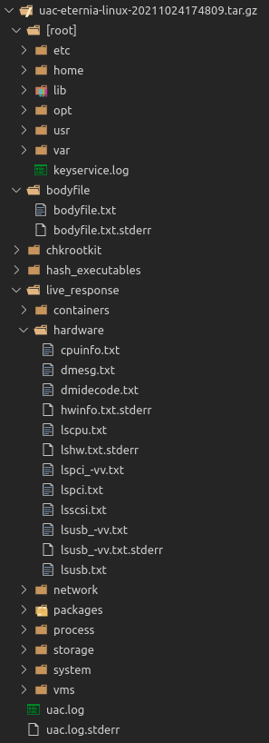

# Output file format

A compressed archive (tar.gz) file is created in the destination directory when the collection is finished. The following pattern is used for naming output files: ```uac-HOSTNAME-OPERATING_SYSTEM-YYYYMMDDhhmmss.tar.gz```. The compressed archive file is hashed and the value is stored in the acquisition log file.

Each artifact will be stored in its directory. Files collected by [file](collectors.md#file-collector) collector will be placed into the ```[root]``` directory.


