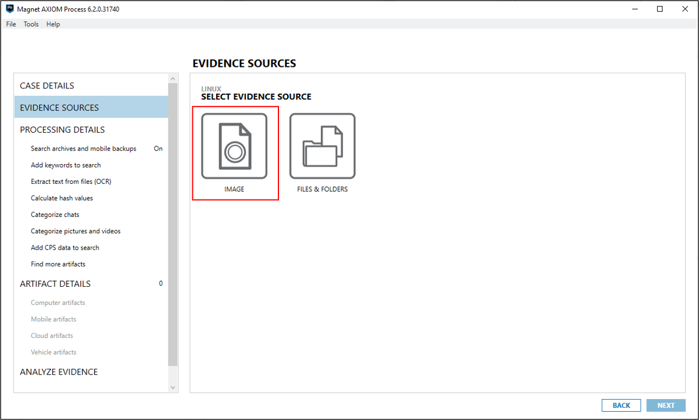
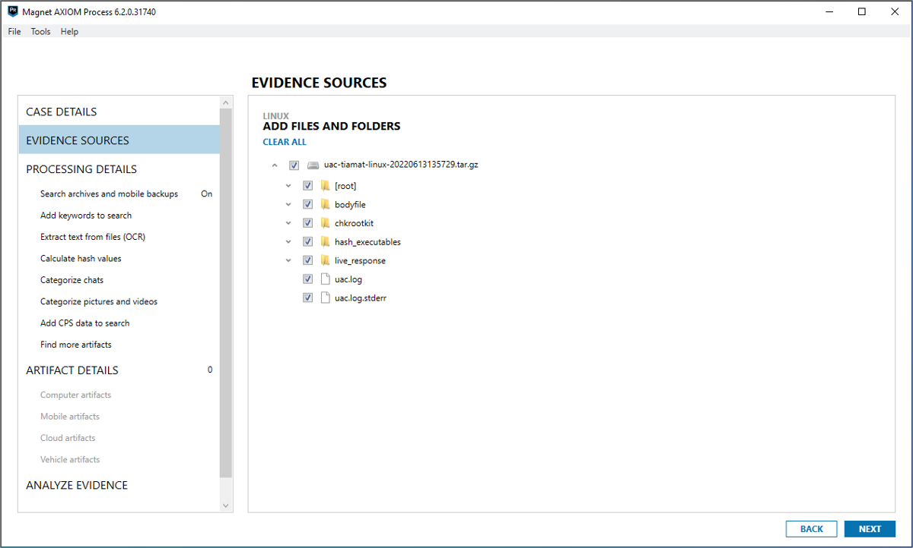
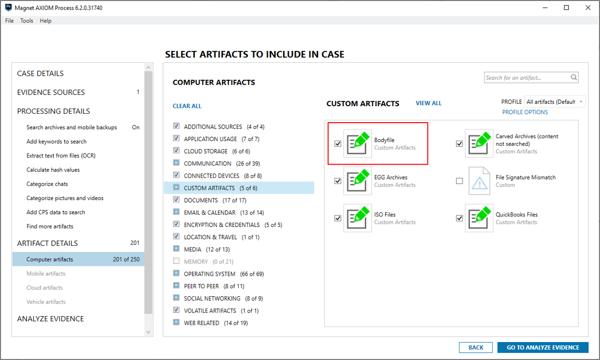
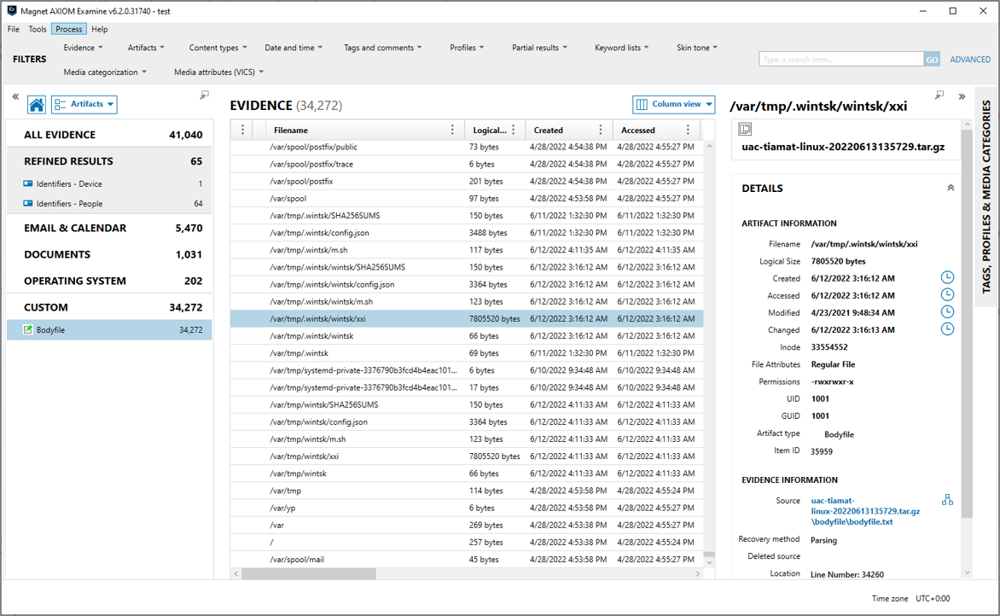
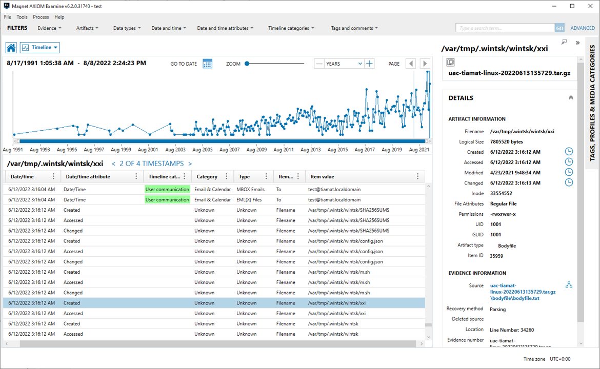

# Super Timeline creation

## Using Plaso

Plaso is a python-based backend engine that powers log2timeline. Log2timeline is a tool designed to extract timestamps and forensic artifacts from a computer system to facilitate analysis. It creates what we refer to as a "Super Timeline". If you haven't watched it already, there is a great YouTube video by Richard Davis of 13cubed that I suggest you start with.

For more information about Plaso please refer to the [official documentation page](https://plaso.readthedocs.io).

### Plaso in a docker container

#### Obtaining a Plaso docker image

```shell
docker pull log2timeline/plaso
```

#### Parsing UAC output file

First start the extraction with log2timeline. Your UAC output file should be present on the host, and not in the container (which is the default scenario), you’ll have to set up a bridge between the two. For example, if you store your current UAC output file to analyze in ```/data/uac-testvm-linux-20220204120054.tar.gz```, you could tell log2timeline to generate the Plaso storage file as ```/data/uac-testvm-linux-20220204120054.plaso``` this way:

```shell
docker run -v /data:/data log2timeline/plaso:latest log2timeline --process_archives --storage-file /data/uac-testvm-linux-20220204120054.plaso /data/uac-testvm-linux-20220204120054.tar.gz
```

This way your Plaso file will also be stored on the host filesystem.

#### Run analysis with psort

The ```/data/uac-testvm-linux-20220204120054.plaso``` file is the database file created by log2timeline, which can be exported to a CSV file (which can be read using ie. Eric Zimmermans [timeline explorer](https://ericzimmerman.github.io)).

You need to run psort to create a complete timeline of everything.

```shell
docker run -v /data:/data log2timeline/plaso:latest psort.py -o l2tcsv /data/uac-testvm-linux-20220204120054.plaso -w /data/uac-testvm-linux-20220204120054.csv
```

## Using Magnet AXIOM

You can also use Magnet AXIOM to extract timestamps and forensic artifacts from UAC's output file to create Super Timelines.

### Bodyfile custom artifact

It is strongly recommended that you download and install the Bodyfile custom artifact before processing UAC's output file in Magnet AXIOM. This custom artifact parses the bodyfile.txt file generated by UAC. The custom artifact can be downloaded from Magnet Forensics [Artifact Exchange page](https://artifacts.magnetforensics.com).

### Parsing UAC output file

Load the output file as a Linux or macOS disk image.





Make sure the Bodyfle custom artifact is enabled.



### Analyzing the results with Magnet AXIOM Examine

#### Parsed artifacts



#### Timeline

